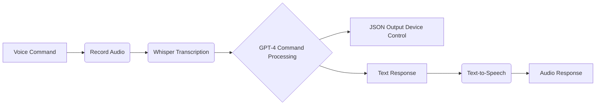

# Smart Home Assistant - Your Voice, Your Control

## Effortlessly Manage Your Smart Home with AI-Powered Voice Commands!

This project empowers you to control your smart home devices using natural language voice commands. Leveraging the power of OpenAI's GPT-4 and Whisper models, this assistant understands your intent and translates it into actionable instructions. Imagine controlling your lights, music, and more with just your voice!

**Key Features:**

* **Intuitive Voice Control:**  Interact with your smart home using natural language commands.
* **Intelligent Command Processing:** GPT-4 interprets your commands and generates structured JSON for device control.
* **Seamless Integration:**  Easily adaptable to various smart home ecosystems (future development).
* **Real-time Transcription:**  Whisper accurately transcribes your voice commands into text.
* **Text-to-Speech Feedback:**  Receive clear and concise audio responses from the assistant.
* **User-Friendly Interface:**  Built with Streamlit for a simple and intuitive user experience.

## Live Demo

Experience the future of smart home control with our interactive demo hosted on Hugging Face Spaces:

[](https://shresthasingh-smart-home-assistant.hf.space) 

## Workflow

Here's a visual representation of how the Smart Home Assistant works:



## Getting Started

1. **Clone the Repository:**
   ```bash
   git clone https://github.com/shresthasingh1501/smart-home-assistant.git
   ```

2. **Install Dependencies:**
   ```bash
   pip install -r requirements.txt
   ```

3. **Obtain an OpenAI API Key:**
   * Visit [https://platform.openai.com/account/api-keys](https://platform.openai.com/account/api-keys) to get your API key.

4. **Update `app.py`:**
   * Replace `""` with your actual OpenAI API key.

5. **Run the Application:**
   ```bash
   streamlit run app.py
   ```

## Usage

1. **Open the Streamlit Interface:** Access the provided URL in your web browser.
2. **Click "Start Recording":**  Speak your smart home command clearly.
3. **View Results:** The app will display the transcribed text, the generated JSON output, and provide an audio response.

## Example Commands

* "Turn on the living room lights."
* "Set the bedroom temperature to 70 degrees."
* "Play some relaxing music on Spotify."

## Important Notes

* **API Key:**  The application requires an OpenAI API key. Replace the placeholder with your key for functionality.
* **Security:**  Avoid hardcoding API keys in production environments. Consider using environment variables or a secure vault.
* **Future Development:**  Integration with specific smart home platforms is planned for future releases.

## Contributing

Contributions, issues, and feature requests are welcome! Feel free to check the issues page if you want to contribute.

## License

MIT

**Created by Shrestha Singh**
